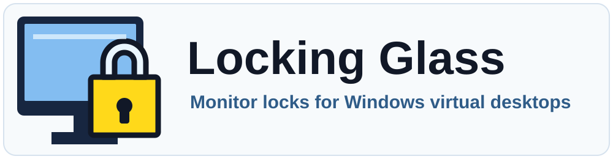

  

Locking Glass is a Windows tray app for pinning selected monitors while you switch Windows virtual desktops.

Locked monitors keep their visible windows in place. Unlocked monitors keep following normal Windows virtual desktop behavior.

When you unlock a monitor, Locking Glass returns the current top-level windows on that borrowed monitor back to its original virtual desktop where Windows allows it.

If you switch onto the temporary `Locking Glass` holding desktop while a monitor is locked, parked workspace windows are restored to their own desktops. The locked monitor content can keep following you until you unlock it.

## Download

Get the latest release from GitHub:

- [Locking Glass Installer.exe](https://github.com/GeekKingCloud/locking-glass/releases/latest/download/Locking.Glass.Installer.exe)
  installs or updates Locking Glass for the current Windows user, enables startup, and launches the tray app.
- [Locking Glass.exe](https://github.com/GeekKingCloud/locking-glass/releases/latest/download/Locking.Glass.exe)
  runs Locking Glass once without installing startup.

Windows may show an unsigned-app warning. The release is not code-signed yet.

## Requirements

- Windows
- at least two monitors
- at least two Windows virtual desktops

## Use

Run `Locking Glass Installer.exe` if you want Locking Glass available after sign-in.

Run `Locking Glass.exe` if you only want to try it for the current session.

After launch, use the tray icon:

- left-click to lock or unlock monitors
- right-click for refresh, status, and exit actions

Every app start begins unlocked. Locking Glass remembers monitor identity, but it does not automatically re-lock monitors from a previous run.

## Update Or Remove

Run a newer `Locking Glass Installer.exe` to update the app in place.

To remove Locking Glass, use Windows Add or Remove Programs or the Start Menu uninstall shortcut created by the installer. The uninstaller removes startup, shortcuts, and installed app files.

## Source

Developer setup, tests, release checks, and contribution notes live in [CONTRIBUTING.md](CONTRIBUTING.md) and [AGENTS.md](AGENTS.md).

Release notes live in [CHANGELOG.md](CHANGELOG.md).

Locking Glass is licensed under `GPL-3.0-only`. See [LICENSE](LICENSE).
